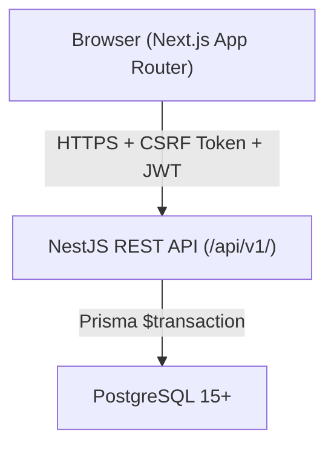
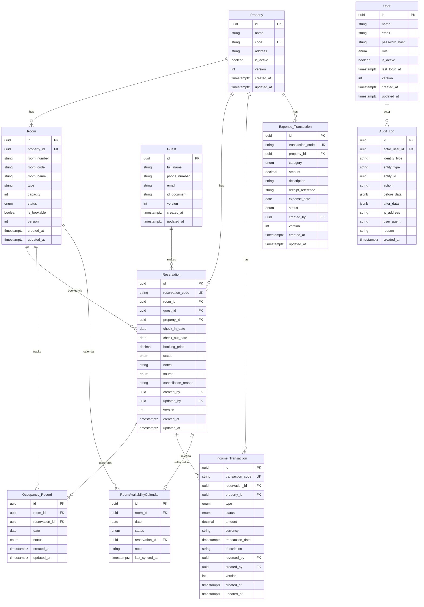

# Design Document: Hotel Dashboard

## Overview

Hotel Dashboard adalah sistem manajemen operasional hotel internal berbasis web. Sistem ini menyediakan antarmuka terpusat bagi Owner dan Admin untuk mengelola properti, kamar, tamu, reservasi, pendapatan, pengeluaran, dan laporan hunian di seluruh properti.

Sistem ini bukan website pemesanan publik. Seluruh akses dibatasi oleh autentikasi dan RBAC (Role-Based Access Control) dengan tiga peran: Owner, Admin, dan Auditor.

### Prinsip Desain Utama

- **Atomisitas**: Setiap operasi yang melibatkan lebih dari satu tabel (Reservation + Occupancy_Record + Income_Transaction) dieksekusi dalam satu transaksi database.
- **Konsistensi Zona Waktu**: Semua timestamp disimpan dalam UTC; konversi ke Asia/Jakarta hanya dilakukan di lapisan tampilan.
- **RBAC Berlapis**: Pemeriksaan hak akses diterapkan di backend (API) dan frontend (visibilitas UI).
- **Optimistic Locking**: Mencegah konflik pengeditan bersamaan dengan version field pada entitas yang dapat diedit.
- **Audit Trail**: Setiap operasi tulis mencatat entri ke Audit_Log.

---

## Architecture

Sistem menggunakan arsitektur client-server dua lapisan dengan frontend Next.js (App Router) dan backend NestJS REST API yang terhubung ke PostgreSQL via Prisma ORM. Monorepo dikelola dengan pnpm workspaces.

### Tech Stack

| Layer | Stack |
|---|---|
| Frontend | Next.js 14 (App Router) + TypeScript + Tailwind CSS + shadcn/ui |
| State / Data Fetching | Zustand + TanStack Query (React Query v5) |
| Charts | Recharts |
| Form Validation | React Hook Form + Zod |
| Backend | NestJS + TypeScript |
| ORM | Prisma |
| Database | PostgreSQL 15+ |
| Auth | JWT (access 15m + refresh 7d) + CSRF token |
| Testing | Jest + Supertest (backend), Vitest + Testing Library (frontend), fast-check (PBT) |



### Lapisan Sistem

```
┌─────────────────────────────────────────────────────┐
│  Frontend (Next.js 14 App Router)                   │
│  ├── app/(auth)/          Login                     │
│  ├── app/(dashboard)/     Protected routes          │
│  ├── features/            Feature modules           │
│  ├── services/            TanStack Query + fetch    │
│  ├── stores/              Zustand                   │
│  └── utils/               Timezone, IDR formatting  │
├─────────────────────────────────────────────────────┤
│  Backend (NestJS, versioned at /api/v1/)            │
│  ├── modules/             Feature modules           │
│  ├── guards/              RBAC + JWT guards         │
│  ├── middleware/          CSRF, logging             │
│  ├── prisma/              Prisma service            │
│  └── common/              DTOs, decorators, utils   │
├─────────────────────────────────────────────────────┤
│  PostgreSQL 15+                                     │
│  └── Prisma schema, migrations, optimistic locking  │
└─────────────────────────────────────────────────────┘
```

### Alur Request

1. Browser mengirim request HTTPS dengan CSRF token dan JWT (Authorization header atau httpOnly cookie).
2. NestJS Guard memverifikasi JWT dan peran pengguna (RBAC) sebelum request mencapai handler.
3. Module service memproses bisnis logic; operasi multi-tabel dibungkus dalam `prisma.$transaction`.
4. Response dikembalikan; frontend mengkonversi timestamp UTC ke Asia/Jakarta sebelum ditampilkan.

### API Versioning

Seluruh endpoint diawali `/api/v1/` untuk mendukung ekspansi ke `/api/v2/` atau layanan terpisah di masa depan (Phase 4: public booking engine).

### Catatan Extensibility (Phase 4)

Prisma schema dirancang extensible: field `source` pada `Reservation` (internal/manual/future_public), dan field `rate_plan`, `payment`, `channel` dicadangkan untuk integrasi public booking engine dan OTA di Phase 4.

---

## Components and Interfaces

### Backend Modules

Setiap modul mengikuti pola: **Controller → Service → Repository**.

| Modul | Tanggung Jawab |
|---|---|
| `auth` | Login, logout, session/JWT, CSRF |
| `users` | Manajemen akun pengguna dan peran (Owner only) |
| `properties` | CRUD property, validasi kode unik, deaktivasi |
| `rooms` | CRUD room, validasi nomor unik per property, relokasi |
| `guests` | CRUD guest, pencarian |
| `reservations` | Lifecycle reservasi, overlap check, swap room |
| `occupancy` | Occupancy_Record management, kalender grid |
| `income` | Income_Transaction CRUD, reversal, adjustment |
| `expenses` | Expense_Transaction CRUD, soft-delete |
| `dashboard` | Agregasi KPI, tren revenue, performa property |
| `occupancy-performance` | Kalkulasi Occupancy_Rate per room/periode |
| `audit-log` | Pencatatan dan pembacaan Audit_Log |

### REST API Endpoints (ringkasan)

Semua endpoint diawali `/api/v1/` untuk mendukung versioning.

```
POST   /api/v1/auth/login
POST   /api/v1/auth/logout

GET    /api/v1/properties
POST   /api/v1/properties
PATCH  /api/v1/properties/:id
PATCH  /api/v1/properties/:id/deactivate

GET    /api/v1/rooms?propertyId=
POST   /api/v1/rooms
PATCH  /api/v1/rooms/:id
POST   /api/v1/rooms/:id/relocate

GET    /api/v1/guests?search=
POST   /api/v1/guests
PATCH  /api/v1/guests/:id

GET    /api/v1/reservations
POST   /api/v1/reservations
PATCH  /api/v1/reservations/:id
POST   /api/v1/reservations/:id/confirm
POST   /api/v1/reservations/:id/checkin
POST   /api/v1/reservations/:id/checkout
POST   /api/v1/reservations/:id/cancel
POST   /api/v1/reservations/:id/swap-room

GET    /api/v1/rooms/:room_id/calendar?month=&year=

GET    /api/v1/income/transactions
POST   /api/v1/income/transactions
PATCH  /api/v1/income/transactions/:id
POST   /api/v1/income/transactions/:id/post
POST   /api/v1/income/transactions/:id/reverse

GET    /api/v1/expenses
POST   /api/v1/expenses
PATCH  /api/v1/expenses/:id
POST   /api/v1/expenses/:id/cancel

GET    /api/v1/dashboard/summary?propertyId=&month=&year=
GET    /api/v1/analytics/occupancy-performance?propertyId=&month=&year=
GET    /api/v1/analytics/revenue-trend?propertyId=&year=
GET    /api/v1/analytics/expense-breakdown?propertyId=&month=&year=

GET    /api/v1/reports/export?type=income|expense&format=csv|excel&propertyId=&month=&year=

GET    /api/v1/audit-log?entityType=&action=&from=&to=
```

### Frontend Pages

| Halaman | Route | Akses |
|---|---|---|
| Login | `/login` | Public |
| Dashboard | `/` | Owner, Admin, Finance |
| Properties | `/properties` | Owner |
| Rooms | `/rooms` | Owner, Admin, Staff Operasional |
| Guests | `/guests` | Admin |
| Reservations | `/reservations` | Owner, Admin, Staff Operasional |
| Calendar | `/calendar` | Owner, Admin, Staff Operasional |
| Income | `/income` | Owner, Admin, Finance |
| Expenses | `/expenses` | Owner, Admin, Finance |
| Reports / Export | `/reports` | Owner, Admin, Finance |
| Occupancy Performance | `/occupancy` | Owner, Admin |
| Audit Log | `/audit-log` | Owner, Auditor |
| User Management | `/users` | Owner |

---

## Data Models

### Entity Relationship Diagram



### Enum Values

**User.role**: `owner` | `admin` | `staff_operasional` | `finance` | `auditor`

**Room.status**: `active` | `maintenance` | `blocked` | `inactive`

**Reservation.status**: `draft` | `confirmed` | `checked_in` | `checked_out` | `cancelled` | `no_show` | `completed`

**Reservation.source**: `internal` | `manual` | `future_public`

**Occupancy_Record.status**: `booked` | `occupied` | `past` | `cancelled` | `no_show` | `blocked`

**RoomAvailabilityCalendar.status**: `available` | `booked` | `blocked` | `maintenance` | `checked_in` | `checked_out`

**Income_Transaction.type**: `room_income` | `manual_income` | `refund` | `adjustment` | `reversal`

**Income_Transaction.status**: `draft` | `posted` | `reversed` | `cancelled`

**Expense_Transaction.status**: `draft` | `posted` | `cancelled`

**Expense_Transaction.category**: `maintenance_expenses` | `operational_expenses`

### Aturan Bisnis Kritis pada Data Model

- `Room.room_code` unik dalam lingkup satu `property_id`.
- `Property.code` unik secara global.
- `Reservation` overlap dicek dengan: `check_in_date < existing.check_out_date AND check_out_date > existing.check_in_date` (check-in inklusif, check-out eksklusif).
- `Occupancy_Record` dibuat satu baris per hari per kamar untuk setiap Reservation aktif.
- `version` field digunakan untuk optimistic locking: UPDATE hanya berhasil jika `version` cocok, lalu di-increment.
- Semua `timestamptz` disimpan dalam UTC.

---

## Correctness Properties

*A property is a characteristic or behavior that should hold true across all valid executions of a system — essentially, a formal statement about what the system should do. Properties serve as the bridge between human-readable specifications and machine-verifiable correctness guarantees.*

Library PBT yang digunakan: **fast-check** (frontend & backend).

---

### Property 1: No Double Booking (Overlap Prevention)

**Deskripsi**: Tidak boleh ada dua Reservation aktif pada room yang sama dengan rentang tanggal yang overlap.

**Definisi overlap**: `A.check_in_date < B.check_out_date AND A.check_out_date > B.check_in_date`

**Status aktif**: `draft`, `confirmed`, `checked_in`

```typescript
// fast-check property
fc.property(
  fc.record({
    roomId: fc.uuid(),
    checkIn: fc.date({ min: new Date('2024-01-01') }),
    nights: fc.integer({ min: 1, max: 30 }),
  }),
  async ({ roomId, checkIn, nights }) => {
    const checkOut = addDays(checkIn, nights);
    // Create first reservation
    await createReservation({ roomId, checkIn, checkOut });
    // Attempt overlapping reservation — must fail
    const result = await tryCreateReservation({ roomId, checkIn, checkOut });
    return result.success === false;
  }
)
```

**Invariant**: `∀ r1, r2 ∈ Reservation, r1 ≠ r2, r1.room_id = r2.room_id, r1.status ∈ {draft,confirmed,checked_in}, r2.status ∈ {draft,confirmed,checked_in} ⟹ ¬overlap(r1, r2)`

---

### Property 2: Atomic Reservation + Occupancy + Income Operations

**Deskripsi**: Setiap operasi yang melibatkan Reservation, Occupancy_Record, dan Income_Transaction harus berhasil seluruhnya atau gagal seluruhnya (tidak ada partial state).

```typescript
fc.property(
  fc.record({ reservationData: arbitraryReservation() }),
  async ({ reservationData }) => {
    const before = await snapshotCounts(); // {reservations, occupancyRecords, incomeTransactions}
    const result = await createReservationWithOccupancy(reservationData);
    const after = await snapshotCounts();

    if (result.success) {
      // All three must have increased together
      return (
        after.reservations === before.reservations + 1 &&
        after.occupancyRecords >= before.occupancyRecords + nights(reservationData)
      );
    } else {
      // On failure, nothing must have changed
      return (
        after.reservations === before.reservations &&
        after.occupancyRecords === before.occupancyRecords &&
        after.incomeTransactions === before.incomeTransactions
      );
    }
  }
)
```

**Invariant**: `∀ op ∈ {create, confirm, checkin, checkout, cancel, swap}: op berhasil ⟹ semua tabel terupdate; op gagal ⟹ tidak ada tabel yang berubah`

---

### Property 3: Reservation Status Lifecycle Transitions

**Deskripsi**: Transisi status Reservation hanya boleh mengikuti alur yang valid.

**Transisi valid**:
- `draft → confirmed`
- `confirmed → checked_in`
- `checked_in → checked_out`
- `checked_out → completed`
- `draft | confirmed | checked_in → cancelled`
- `confirmed → no_show`

**Transisi tidak valid** (harus ditolak): semua transisi lain, termasuk mundur ke status sebelumnya.

```typescript
fc.property(
  fc.record({
    fromStatus: fc.constantFrom('draft','confirmed','checked_in','checked_out','cancelled','no_show','completed'),
    toStatus: fc.constantFrom('draft','confirmed','checked_in','checked_out','cancelled','no_show','completed'),
  }),
  async ({ fromStatus, toStatus }) => {
    const isValidTransition = VALID_TRANSITIONS[fromStatus]?.includes(toStatus) ?? false;
    const result = await attemptStatusTransition(reservationId, fromStatus, toStatus);
    return result.success === isValidTransition;
  }
)
```

**Invariant**: `∀ r ∈ Reservation: transition(r.status, newStatus) berhasil ⟺ (r.status, newStatus) ∈ VALID_TRANSITIONS`

---

### Property 4: Occupancy Rate Calculation Correctness

**Deskripsi**: Occupancy_Rate harus selalu dihitung dengan formula yang benar dan hasilnya berada dalam rentang [0, 100].

**Formula**: `occupancy_rate = (room_nights_occupied / room_nights_available) × 100`

```typescript
fc.property(
  fc.record({
    totalRooms: fc.integer({ min: 1, max: 100 }),
    daysInPeriod: fc.integer({ min: 1, max: 31 }),
    occupiedNights: fc.integer({ min: 0 }),
  }),
  ({ totalRooms, daysInPeriod, occupiedNights }) => {
    const available = totalRooms * daysInPeriod;
    const occupied = Math.min(occupiedNights, available); // cannot exceed available
    const rate = calculateOccupancyRate(occupied, available);
    return rate >= 0 && rate <= 100 && Math.abs(rate - (occupied / available) * 100) < 0.01;
  }
)
```

**Invariant**: `∀ period, property: 0 ≤ occupancy_rate(period, property) ≤ 100`

---

### Property 5: Income Total Consistency

**Deskripsi**: Total income yang ditampilkan harus selalu sama dengan jumlah semua Income_Transaction berstatus `posted` dikurangi nilai `reversal` dan `refund`.

```typescript
fc.property(
  fc.array(arbitraryIncomeTransaction(), { minLength: 0, maxLength: 50 }),
  async (transactions) => {
    await seedTransactions(transactions);
    const displayed = await getDashboardTotalIncome(propertyId, period);
    const expected = transactions
      .filter(t => t.status === 'posted')
      .reduce((sum, t) => {
        if (t.type === 'reversal' || t.type === 'refund') return sum - t.amount;
        return sum + t.amount;
      }, 0);
    return Math.abs(displayed - expected) < 0.01;
  }
)
```

**Invariant**: `total_income = Σ(posted, non-reversal/refund) - Σ(posted, reversal+refund)`

---

### Property 6: Audit Log Immutability

**Deskripsi**: Entri Audit_Log tidak boleh pernah diubah atau dihapus setelah dibuat. Setiap operasi tulis pada entitas kritis harus menghasilkan tepat satu entri baru di Audit_Log.

```typescript
fc.property(
  fc.record({ operation: arbitraryWriteOperation() }),
  async ({ operation }) => {
    const countBefore = await countAuditLogs();
    await performOperation(operation);
    const countAfter = await countAuditLogs();
    const latestLog = await getLatestAuditLog();

    return (
      countAfter === countBefore + 1 &&
      latestLog.before_data !== null &&  // snapshot captured
      latestLog.after_data !== null &&
      latestLog.created_at !== null
    );
  }
)
```

**Invariant**: `∀ log ∈ Audit_Log: log tidak dapat di-UPDATE atau di-DELETE; |Audit_Log| hanya bertambah`
